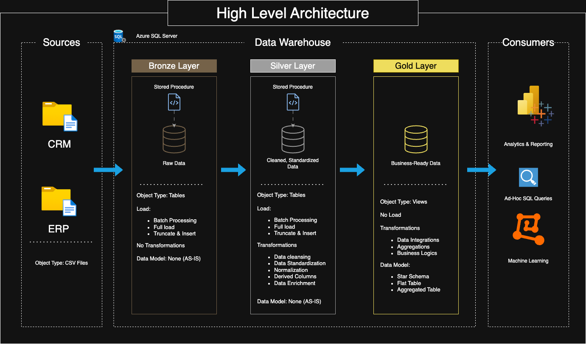
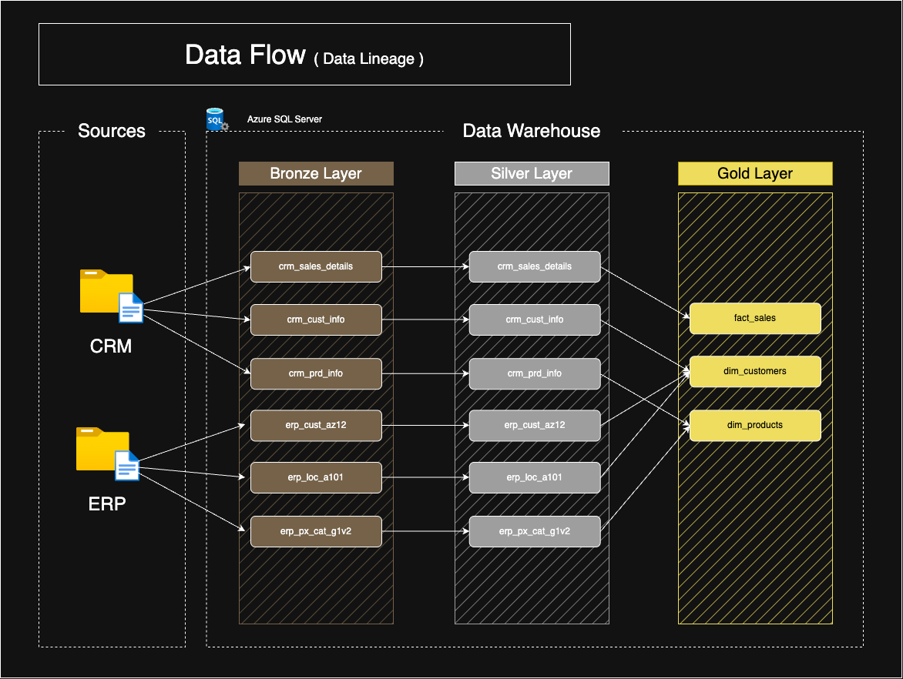
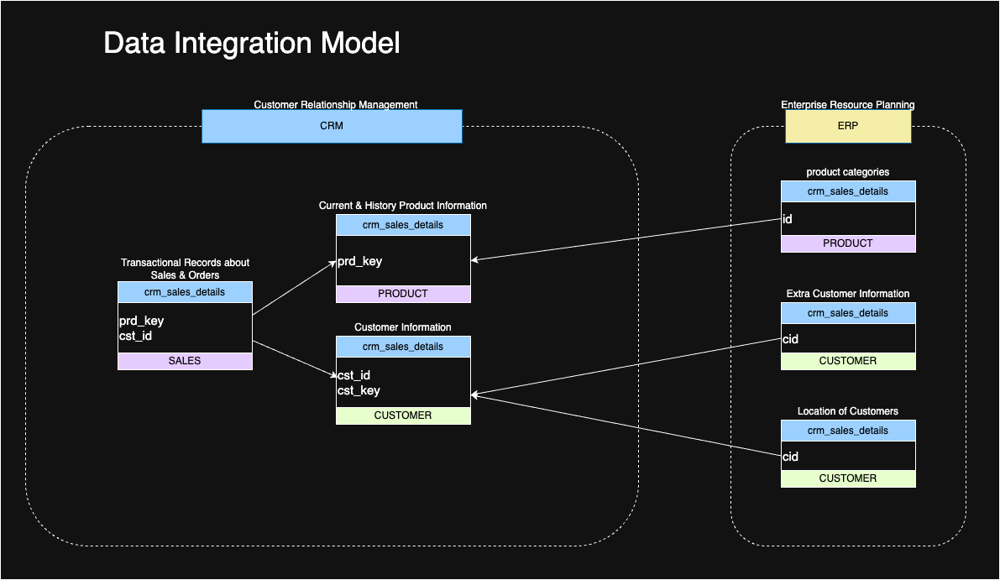
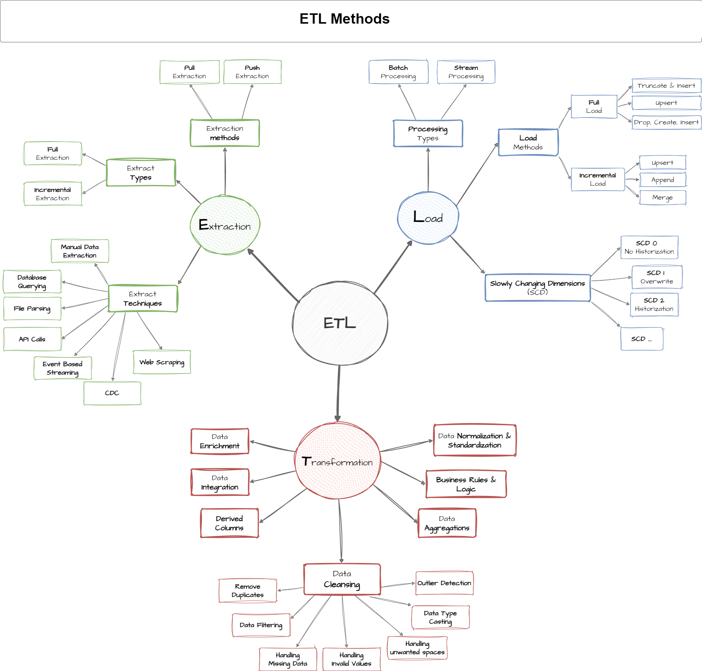
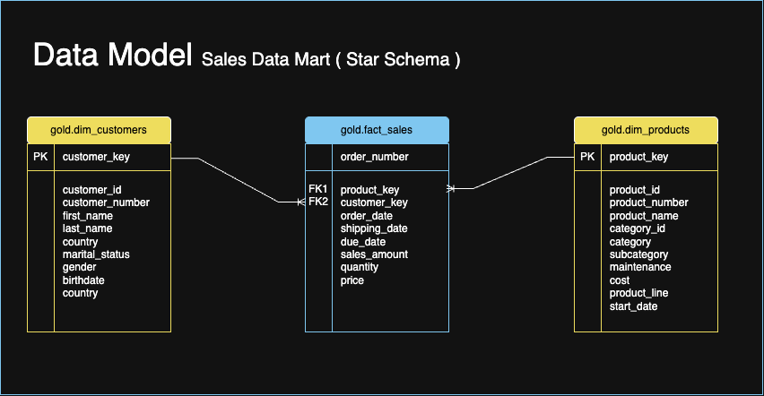

# SQL Data Warehouse Project


This project demonstrates a comprehensive data warehousing solution built with SQL Server, implementing the modern Medallion Architecture pattern. It showcases end-to-end data engineering practices from raw data ingestion to business-ready analytics layers.

---

## Project Overview

This project implements a complete data warehousing solution that consolidates data from multiple source systems (CRM and ERP) into a unified, analytics-ready data warehouse. The solution follows industry best practices and demonstrates proficiency in:

- **Data Architecture Design** using Medallion Architecture
- **ETL Pipeline Development** with SQL Server
- **Data Quality Management** and validation
- **Dimensional Modeling** with Star Schema
- **Business Intelligence Preparation**

---

## Architecture Overview

The project implements the **Medallion Architecture** with three distinct layers:



### Architecture Layers:

1. **Bronze Layer (Raw Data)**
   - Stores data exactly as received from source systems
   - Minimal processing and validation
   - Serves as the single source of truth

2. **Silver Layer (Cleaned Data)**
   - Advanced data cleansing and standardization
   - Complex business rule application
   - Data type conversions and validations
   - Derived column calculations
   - Data enrichment and normalization

3. **Gold Layer (Business Ready)**
   - Dimensional modeling (Star Schema)
   - Aggregated and enriched data
   - Optimized for analytics and reporting

---

## Data Flow & Integration



The data integration follows a systematic approach:



**Source Systems:**
- **CRM System**: Customer information, product details, sales transactions
- **ERP System**: Customer demographics, location data, product categories

---

## ETL Implementation



The project implements comprehensive ETL techniques:
- **Extraction**: Bulk insert from CSV files with error handling
- **Transformation**: Advanced data cleansing, standardization, and enrichment
- **Loading**: Incremental and full load strategies with performance monitoring
- **Data Quality**: Comprehensive validation and error handling

---

## Project Structure

```
SQL_DataWarehouse/
│
├── datasets/                           # Source data files
│   ├── source_crm/                     # CRM system data
│   │   ├── cust_info.csv
│   │   ├── prd_info.csv
│   │   └── sales_details.csv
│   └── source_erp/                     # ERP system data
│       ├── CUST_AZ12.csv
│       ├── LOC_A101.csv
│       └── PX_CAT_G1V2.csv
│
├── scripts/                            # SQL implementation scripts
│   ├── init_database.sql               # Database and schema creation
│   ├── bronze/                         # Bronze layer implementation
│   │   ├── ddl_bronze.sql
│   │   └── proc_load_bronze.sql
│   ├── silver/                         # Silver layer implementation
│   │   ├── ddl_silver.sql
│   │   └── proc_load_silver.sql
│   └── gold/                           # Gold layer implementation
│       └── ddl_gold.sql
│
├── tests/                              # Data quality and validation
│   ├── quality_checks_silver.sql
│   └── quality_checks_gold.sql
│
├── docs/                               # Project documentation
│   ├── data_catalog.md                 # Data dictionary and catalog
│   ├── naming_conventions.md           # Coding standards
│   ├── *.png                          # Architecture diagrams
│   └── drawio/                        # Source diagram files
│
├── .gitignore                          # Git ignore rules
└── README.md                           # Project documentation
```

---

## Advanced Data Transformations (Silver Layer)

The Silver layer implements sophisticated data transformation techniques:

### Data Cleansing & Standardization

#### **Customer Data Normalization**
```sql
-- Gender Standardization with Hidden Character Removal
CASE 
    WHEN UPPER(TRIM(
        REPLACE(REPLACE(REPLACE(gen, CHAR(13), ''), CHAR(10), ''), CHAR(160), '')
    )) IN ('F', 'FEMALE') THEN 'Female'
    WHEN UPPER(TRIM(
        REPLACE(REPLACE(REPLACE(gen, CHAR(13), ''), CHAR(10), ''), CHAR(160), '')
    )) IN ('M', 'MALE') THEN 'Male'
    ELSE 'n/a'
END AS gender

-- Marital Status Standardization
CASE 
    WHEN UPPER(TRIM(cst_marital_status)) = 'S' THEN 'Single'
    WHEN UPPER(TRIM(cst_marital_status)) = 'M' THEN 'Married'
    ELSE 'n/a'
END AS marital_status

-- Country Code Normalization
CASE
    WHEN TRIM(cntry) = 'DE' THEN 'Germany'
    WHEN TRIM(cntry) IN ('US', 'USA') THEN 'United States'
    WHEN TRIM(cntry) = '' OR cntry IS NULL THEN 'n/a'
    ELSE TRIM(cntry)
END AS country
```

### Data Type Conversions & Validations

#### **Advanced Date Transformations**
```sql
-- Integer to Date Conversion with Validation
CASE 
    WHEN sls_order_dt = 0 OR LEN(sls_order_dt) != 8 THEN NULL
    ELSE CAST(CAST(sls_order_dt AS VARCHAR) AS DATE)
END AS order_date

-- Future Date Validation
CASE
    WHEN bdate > GETDATE() THEN NULL
    ELSE bdate
END AS birthdate
```

### Data Integration & Enrichment

#### **System Integration Techniques**
```sql
-- Customer ID Normalization Across Systems
CASE
    WHEN cid LIKE 'NAS%' THEN SUBSTRING(cid, 4, LEN(cid))
    ELSE cid
END AS customer_id

-- Product Category Extraction from Composite Keys
REPLACE(SUBSTRING(prd_key, 1, 5), '-', '_') AS category_id,
SUBSTRING(prd_key, 7, LEN(prd_key)) AS product_key
```

### Transformations acc. to Business Logic

#### **Sales Calculation Validation & Correction**
```sql
-- Recalculate Sales Amount if Invalid
CASE 
    WHEN sls_sales IS NULL OR sls_sales <= 0 
         OR sls_sales != sls_quantity * ABS(sls_price) 
        THEN sls_quantity * ABS(sls_price)
    ELSE sls_sales
END AS sales_amount

-- Product Lifecycle Management using Window Functions
CAST(
    LEAD(prd_start_dt) OVER (PARTITION BY prd_key ORDER BY prd_start_dt) - 1 
    AS DATE
) AS product_end_date
```

### Data Quality Techniques Implemented

- **Deduplication**: ROW_NUMBER() with PARTITION BY for latest records
- **Hidden Character Removal**: CHAR(13), CHAR(10), CHAR(160) cleaning
- **Null Handling**: ISNULL, COALESCE, NULLIF functions
- **Data Validation**: Range checks, format validation, referential integrity
- **Text Standardization**: TRIM, UPPER, consistent casing

---

## Dimensional Modeling & Star Schema



The Gold layer implements a sophisticated **Star Schema** optimized for analytical queries:

### Design Principles & Architecture

- **Surrogate Keys**: Auto-generated integer keys for all dimensions
- **Slowly Changing Dimensions**: Type 1 SCD implementation
- **Fact Table Optimization**: Foreign keys to dimensions with additive measures
- **Denormalization**: Flattened dimensions for query performance

### Dimensional Implementation

#### **Surrogate Key Generation**
```sql
-- Customer Dimension Surrogate Key
ROW_NUMBER() OVER (ORDER BY cst_id) AS customer_key

-- Product Dimension Surrogate Key  
ROW_NUMBER() OVER (ORDER BY prd_start_dt, prd_key) AS product_key
```

#### **Multi-Source Data Integration**
```sql
-- Customer Dimension: Merging CRM + ERP Data
SELECT
    ci.cst_id AS customer_id,
    ci.cst_firstname AS first_name,
    la.cntry AS country,  -- From ERP Location
    CASE 
        WHEN ci.cst_gndr != 'n/a' THEN ci.cst_gndr  -- CRM Priority
        ELSE COALESCE(ca.gen, 'n/a')                -- ERP Fallback
    END AS gender,
    ca.bdate AS birthdate  -- From ERP Demographics
FROM silver.crm_cust_info ci
LEFT JOIN silver.erp_cust_az12 ca ON ci.cst_key = ca.cid
LEFT JOIN silver.erp_loc_a101 la ON ci.cst_key = la.cid
```

#### **Product Hierarchy Design**
```sql
-- Product Dimension with Category Hierarchy
SELECT
    pn.prd_id AS product_id,
    pn.prd_nm AS product_name,
    pn.cat_id AS category_id,
    pc.cat AS category,        -- Level 1
    pc.subcat AS subcategory,  -- Level 2  
    pn.prd_line AS product_line -- Level 3
FROM silver.crm_prd_info pn
LEFT JOIN silver.erp_px_cat_g1v2 pc ON pn.cat_id = pc.id
```

### Fact Table Design

**Grain Definition**: One row per sales order line item
- **Measures**: Sales amount, quantity, unit price (all additive)
- **Dimensions**: Customer, Product, Time (implicit through dates)

```sql
-- Fact-Dimension Relationships
SELECT
    sd.sls_ord_num AS order_number,
    pr.product_key,   -- FK to dim_products
    cu.customer_key,  -- FK to dim_customers
    sd.sls_sales AS sales_amount,  -- Additive measure
    sd.sls_quantity AS quantity    -- Additive measure
FROM silver.crm_sales_details sd
LEFT JOIN gold.dim_products pr ON sd.sls_prd_key = pr.product_number
LEFT JOIN gold.dim_customers cu ON sd.sls_cust_id = cu.customer_id
```

---

## Data Catalog

### Gold Layer Schema

#### `gold.dim_customers`
| Column | Type | Description |
|--------|------|-------------|
| customer_key | INT | Surrogate key (Primary Key) |
| customer_id | INT | Business key from CRM |
| customer_number | NVARCHAR(50) | Customer reference number |
| first_name | NVARCHAR(50) | Customer first name |
| last_name | NVARCHAR(50) | Customer last name |
| country | NVARCHAR(50) | Customer country |
| marital_status | NVARCHAR(50) | Marital status (standardized) |
| gender | NVARCHAR(50) | Gender (standardized) |
| birthdate | DATE | Date of birth |
| create_date | DATE | Customer creation date |

#### `gold.dim_products`
| Column | Type | Description |
|--------|------|-------------|
| product_key | INT | Surrogate key (Primary Key) |
| product_id | INT | Business key from CRM |
| product_number | NVARCHAR(50) | Product reference number |
| product_name | NVARCHAR(50) | Product name |
| category_id | NVARCHAR(50) | Product category ID |
| category | NVARCHAR(50) | Product category |
| subcategory | NVARCHAR(50) | Product subcategory |
| maintenance | NVARCHAR(50) | Maintenance requirement |
| cost | INT | Product cost |
| product_line | NVARCHAR(50) | Product line |
| start_date | DATE | Product availability start date |

#### `gold.fact_sales`
| Column | Type | Description |
|--------|------|-------------|
| order_number | NVARCHAR(50) | Sales order number |
| product_key | INT | Foreign key to dim_products |
| customer_key | INT | Foreign key to dim_customers |
| order_date | DATE | Order placement date |
| shipping_date | DATE | Order shipping date |
| due_date | DATE | Payment due date |
| sales_amount | INT | Total sales amount |
| quantity | INT | Quantity ordered |
| price | INT | Unit price |

---

## Testing & Quality Assurance

### Comprehensive Data Quality Validation

#### Silver Layer Validation
- Primary key uniqueness and null checks
- Data standardization verification
- Date range and format validation
- Cross-field consistency checks

#### Gold Layer Validation
- Surrogate key uniqueness
- Referential integrity between fact and dimensions
- Data model relationship validation

---

## Technologies & Skills Demonstrated

### **Technologies Used**
- **Database**: SQL Server
- **ETL**: T-SQL Stored Procedures
- **Data Modeling**: Star Schema Design
- **Version Control**: Git
- **Documentation**: Markdown
- **Diagramming**: Draw.io

### **Key Skills Showcased**
- **Data Architecture**: Medallion Architecture implementation
- **Advanced SQL Development**: Complex T-SQL programming with window functions
- **ETL Pipeline Development**: Extract, Transform, Load with error handling
- **Dimensional Modeling**: Star schema design and optimization
- **Data Quality Engineering**: Comprehensive validation and cleansing
- **System Integration**: Multi-source data consolidation
- **Performance Optimization**: Query optimization and indexing strategies

---

## Documentation

- **[Data Catalog](docs/data_catalog.md)** - Complete data dictionary
- **[Naming Conventions](docs/naming_conventions.md)** - Coding standards and guidelines
- **Architecture Diagrams** - Visual representations of the solution

---

## Reference

This project was developed following the comprehensive SQL bootcamp by **Data with Baraa**:

**[Data with Baraa SQL Bootcamp](
https://youtube.com/playlist?list=PLNcg_FV9n7qZY_2eAtUzEUulNjTJREhQe&si=69f1kmj2RFzzDXBn)**  
Special thanks to Baraa Khatib Salkini for sharing real world knowledge in modern data warehousing practices.

---

*Built with ❤️ for SQL*